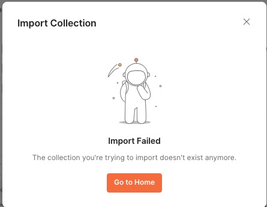
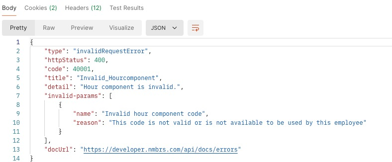
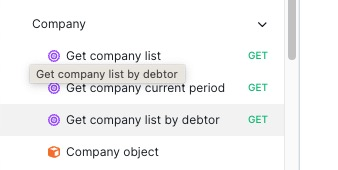
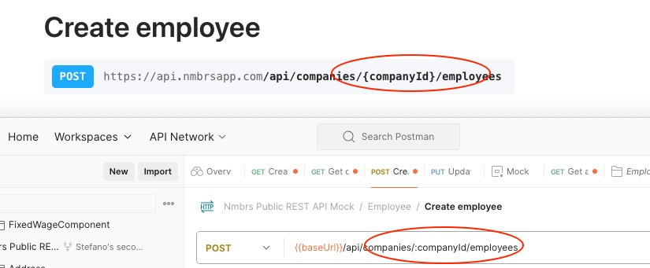

# Planning

The exercise had the following goals:

>Numbers is expanding the partner integrations and has to work with many partners. Currently,
>our partners' managers spend a significant amount of time explaining how to start with the API.
>We want to reduce the volume of support questions about getting started with API. Create a
>strategic roadmap to improve the documentation.
>1. List all the initiatives in the order of priority.
>2. Explain the expected impact of each initiative on the goal.

## Proposal

To determine the priorities for the initiatives, I propose an approach that consists of the following steps:

1. [Audit support tickets](#1-audit-support-tickets)
2. [Triage issues](#2-triage-issues)
3. [Prioritize initiatives](#3-prioritize-initiatives)
4. [Example](#example)

### 1. Audit support tickets

The most important thing here is to establish a reliable way to measure the impact of each issue. This starts by properly classifying support tickets, their severity, and reporting the time spent to solve each one.

A possible definition of severity is:

- Very high: preventing all users from advancing (e.g. outages, broken links, wrong examples, no workaround available)
- High: preventing some users from advancing and no workaround available (e.g. outages, broken links, wrong examples, no workaround available)
- Medium: not preventing users from advancing but causing friction, a reduction in confidence, and longer time spent (e.g. missing information, inconsistent examples or parameters, workaround available)
- Low: not preventing users from advancing and not causing a reduction in confidence (e.g. task-based end-to-end flows, example-based flows, improving introductions and navigation, improving writing style, and so on)

### 2. Triage issues

Reproduce issues in a test environment, open a bug for each, and identify the possible solution to each one of them. This also requires an estimation of the effort needed to fix the issue.

### 3. Prioritize initiatives

Once the auditing and triaging has happened, support tickets can be prioritised using a formula that keeps into account various factors. Then the factors can be used to calculate priority based on the formula:

:::info Score = ( Severity * Impact * Confidence) / Effort.
:::

| Factor  | Explanation |
| - | - |
| Severity | A score can be associated to the severity level indicated in [# 1. Audit support tickets](#1-audit-support-tickets) |
| Impact | How much is this costing the company? Can be calculated by summing the cost of support time (Agent hourly rate x hours spent) + missed revenue generated by the issue (if any). If an issue caused multiple support tickets and multiple revenue opportunities, they must be summed. |
| Confidence | Confidence can be calculated on the volume of support tickets opened for a certain issue. The more the support tickets, the higher the confidence. Each support ticket is worth 1 point. This can often be calculated also by linking support tickets to the same bug |
| Effort | How much effort is required to solve this issue? Is it a quick win? Does it require architectural changes? Engineering or DevOps time? Without making this too complex, it can be calculated in days x persons. |

:::note
The above factors are an adaptation of the [RICE priorization framework](https://www.intercom.com/blog/rice-simple-prioritization-for-product-managers/). RICE helps make decisions more objectively, but it's not free from pitfalls. For example, this does not take into account the impact of each ticket into the company revenue. For example, there could be a very big client that has a small issue and with a fragile business relationship. This framework would not account for such aspects.
:::

## Example

The following are some of the issues I encountered during my exercise. Let's use them as an example to apply the priorization:

The issues are:

1. Postman collection importing causing 404
2. Wrong examples about 'personalInfoId' causing API calls to fail
3. Missing endpoint or information about how a company is created in the system
4. Inconsistent values between API reference and Postman collection

### Applying the framework

Here's a made-up example of the score for each issue.

#### Postman collection cloning causing 404

- **Severity**: Medium (2). This issue prevents users from successfully cloning Postman collections, which is an essential part of their workflow. While it doesn't halt all progress, it does cause frustration and delays.
- **Impact**: $500. Estimated support time: 5 hours x $100/hr = $500.
- **Confidence**: 7. There have been several support tickets related to this issue, indicating a moderate level of user frustration.
- **Effort**: 3 days x 1 person = 3 days.

Score = (2 * $500 * 7) / 3 = 1166.67

#### Wrong examples about 'personalInfoId' causing API calls to fail

- **Severity**: Very high (4). This issue halts user progress entirely, as it leads to failed API calls.
- **Impact**: $1000. Estimated support time: 10 hours x $100/hr = $1000.
- **Confidence**: 5. There have been a few support tickets related to this issue, indicating some user frustration.
- **Effort**: 2 days x 1 person = 2 days.

Score = (4 * 1000 * 5) / 2 = 2500

#### Missing endpoint or information about how a company is created in the system

- **Severity**: High (3). While this issue doesn't halt user progress entirely, it does cause confusion and delays in setting up accounts.
- **Impact**: $700. Estimated support time: 7 hours x $100/hr = $700.
- **Confidence**: 4. There have been several support tickets related to this issue, indicating moderate user frustration.
- **Effort**: 4 days x 1 person = 4 days.

Score = (3 * $700 * 4) / 4 = 700

#### Inconsistent values between API reference and Postman collection

- **Severity**: Medium (2). This issue causes confusion but does not halt user progress entirely.
- **Impact**: $400. Estimated support time: 4 hours x $100/hr = $400.
- **Confidence**: 3. There have been a couple of support tickets related to this issue, indicating mild user frustration.
- **Effort**: 1 day x 1 person = 1 day.

Score = (2 * 400 * 3) / 1 = 1200

### Summary

Based on these scores, the prioritization order would be:

1. Wrong examples about 'personalInfoId' causing API calls to fail
2. Postman collection cloning causing 404
3. Inconsistent values between API reference and Postman collection
4. Missing information about how a company is created in the system

## User community

Developer communities are a great source of ideas for documentation roadmaps and it's the desire of every API company to have an active and engaged dev community.

If resources are short and there's too many issues competing with each other in terms of priority, but the company has an active community, there's also the possibility to let the community prioritize features by upvoting them.

This has the benefit of increasing engagement and transparency. Users could even subscribe to issue updates so that they're automatically informed by the system when an issue makes it to the roadmap and is being tackled.
